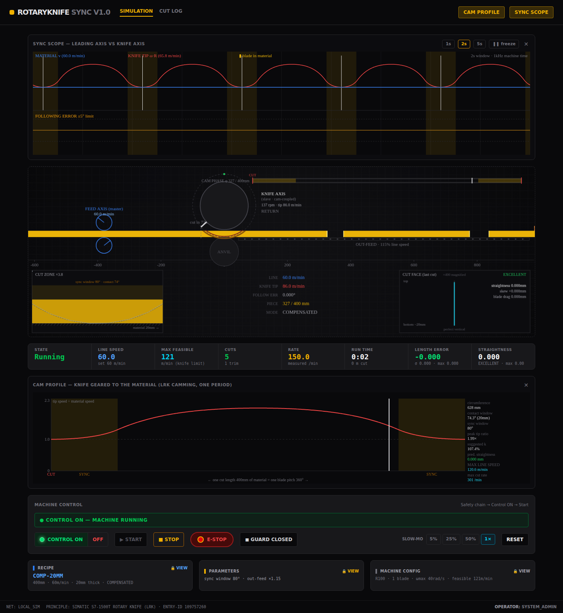

# RotaryKnife SYNC — synchronous cutting test rig

A **minimalist rotary knife machine** (simulation + HMI): one continuously
running material feed, one cam-coupled rotary knife, basic safety control
functions — and nothing else. It exists to answer three questions:

> **How fast** can we cut · **how long** can we run · **how exact** is every
> cut — and what does it take to keep the cut face really, truly STRAIGHT?



## Where this comes from

This project merges the knowledge of three sources:

| Source | What was taken |
|---|---|
| [MotionProfileSolver](https://github.com/Lehel4321/MotionProfileSolver) | The jerk-limited 7-phase S-curve engine (`src/engine/MotionProfile.ts`) that drives the material feed axis and computes committed braking distances |
| [CuttingMaschine](https://github.com/Lehel4321/CuttingMaschine) | The PLC-style architecture (OB1 + FC blocks + DB1 engine class, fixed 1 ms scan), the safety chain (Control-ON, latching E-Stop, interlocks, needsReset), and the HMI look |
| **SIMATIC S7-1500T "Rotary Knife" (LRK)**, Siemens Industry Online Support [Entry-ID 109757260](https://support.industry.siemens.com/cs/document/109757260) | The synchronization principle itself (see below) |

> Note: siemens.com was not reachable from the development environment
> (network policy), so the implementation follows the public description of
> the LRK standard application plus classical rotary-knife/cam theory
> (VDI 2143 polynomial segments, the same segment type the LCamHdl library
> generates). The core ideas — camming, synchronous range, velocity ratio,
> standstill phase, first cut — are the LRK's.

## The principle (how the feeder and the knife are synchronized)

The **feeder is the leading axis** (master). It never stops — the material
runs at line speed straight through the knife. The **knife is the following
axis** (slave): it has *no time base of its own*, its angle is a pure
function of the material position through a **cam** — the software model of
`MC_CamIn` on the S7-1500T:

```
one cut length L of material  ⇒  exactly one blade pitch (360°/knives)

   SYNC WINDOW  (around the cut point): blade speed locked to the material
   RETURN       5th-degree polynomial (VDI 2143) — no velocity/accel steps
   STANDSTILL   for L >> circumference the knife parks and waits (long cuts)
```

Because the cam is **positional**, the piece length and the cut quality are
*independent of line speed* — they stay exact during acceleration, braking
and even during the graceful stop. Speed only enters through the knife
axis' dynamic limits (ωmax, αmax): beyond `MAX FEASIBLE` the axis
saturates, following error grows, and the drive faults — which is exactly
the boundary this rig lets you find experimentally.

### Why "sync" alone does not give a straight cut in thick material

During the cut the blade tip moves on a circle. Classic sync (constant
angular velocity, tip circumference speed = material speed) matches the
**tangential** speed — but the **horizontal** tip speed is `ω·R·cos θ`,
which sags away from bottom dead center. In 20 mm material the entry and
exit happen at θ = ±37°, so the material outruns the blade at the surface
and the face comes out **leaning ~4.4 mm** (R = 100 mm). Measured by the
rig, predicted by the theory — the numbers match to ~1 %.

Three answers, all testable here:

1. **Velocity ratio** (LRK: "cut with a different velocity"):
   `k = α/sin α` re-aligns the face bottom with the entry point
   (the AUTO button in the recipe computes it — ≈107 % at 20 mm).
2. **COMPENSATED cam** (this rig's special): inside the sync window the cam
   is `θ(s) = asin(s/R)` — the tip's horizontal position tracks the
   material *exactly*. Result: **straightness 0.000 mm at 20 mm thickness**
   (see screenshot), at the price of higher cam dynamics at the window edges.
3. **Bigger drum** (larger R flattens the arc) — machine config, test away.

## The machine (deliberately minimal)

- **FC10 Safety** — E-Stop (latching, category-0), knife guard door
  (open ⇒ START interlocked; opening while running ⇒ immediate stop),
  Control-ON with safety check. A trip marks production non-resumable.
- **FC30 Feeder** — leading axis, S-curve limited; graceful STOP brakes the
  line to standstill *exactly on a knife park phase* (blade out of the
  material).
- **FC31 Knife** — following axis; cam setpoint + servo limits + following
  error monitor (drive fault at the configured limit).
- **FC33 Cut** — sub-scan interpolated cut events (piece length to
  ±0.001 mm) and the **cut face recorder**: the blade tip's path through
  the material in the material frame = the physical face. Straightness,
  skew and blade drag per cut.
- **FC34 Out-feed** — speed-up belt pulls a gap between the pieces.
- **OB1** — fixed 1 ms scan, deterministic (same behavior at any FPS).

The first cut after (re)phasing is the **TRIM** cut (the LRK's "first cut"
— it creates the reference edge) and is excluded from the statistics.

## Testing with it

- **How fast**: the cam panel shows `MAX LINE SPEED` for the current recipe
  and drive data. Set the line speed above it → watch the following error
  grow in the sync scope until the knife axis faults. Lower it → find the
  real sustainable rate (cuts/min, measured).
- **How long**: run time, cut counters and meters cut accumulate per test
  campaign (kept across E-Stop, cleared by RESET).
- **How exact**: per-cut length error (σ, max), face straightness / skew /
  blade drag, live cut-face inspector (×N magnified), **CSV export** of the
  whole log for the test report.
- **Watch it cut**: slow-motion (5–100 %) shows the blade passing through
  up to 20 mm material in the CUT ZONE inset; the sync scope shows the tip
  velocity locking onto the material line in every cut window.

## Run it

```bash
npm ci           # exact locked dependency versions (hash-verified)
npm run dev      # http://localhost:3002 (localhost only)
npm test         # 90 tests, see below
npm run lint     # typecheck
npm run build
```

The test suite proves the machine runs on the MotionProfileSolver math:

- `tests/motionprofile.test.ts` — **golden-vector parity**:
  `golden_vectors.json` is copied verbatim from MotionProfileSolver
  (generated by its Python reference engine) and run against this repo's
  `MotionProfile.ts`; plus the same 4096-combination invariant sweep as
  the original repo, plus consistency of the braking formulas with the
  7-phase profile.
- `tests/machine-sync.test.ts` — a per-scan monitor rides along full
  production runs (8 recipe/machine combinations): the feed axis never
  exceeds Vmax/Amax/jerk, the 0→cruise ramp takes exactly the
  solver-predicted time, the knife axis never exceeds ωmax/αmax and
  never reverses, and inside the material the knife follows the cam
  gearing law (ω = k/R·v resp. k/(R·cosθ)·v). Two identical runs
  produce bit-identical logs (deterministic).
- `tests/cam.test.ts` — cam continuity/monotonicity/periodicity,
  compensation exactness, standstill insertion, trim cut, graceful stop
  to the park phase, E-Stop/guard semantics, overspeed fault,
  ramp-exact piece lengths.
- `tests/recipe-book.test.ts`, `tests/recipe-editor.test.tsx` — the recipe
  library and the editor driven through the DOM: edit → SAVE → load back,
  persistence across a reload, corrupt storage, and the running interlock.
- `tests/nip-rollers.test.ts`, `tests/machine-canvas.test.tsx`,
  `tests/outfeed.test.ts` — the animation is physics, not decoration: the
  in-feed rollers are read back out of the canvas draw calls and must turn
  so that their faces pull the material *forward*, without slip; the
  out-feed belt runs at the line's actual speed.

Operate like a real machine: **Control ON → Start**. Recipe changes only
while stopped; machine config only with the control OFF.

## Recipes

The **Recipe** card opens the product data (cut length, line speed,
thickness, sync mode, velocity ratio) together with the **recipe library**,
which is stored in the browser and survives a reload:

- **Load** a stored product into the machine — the cam is rebuilt for it.
- **Save** stores the machine's current product data under its name. The
  badge says `MODIFIED` / `NOT IN LIBRARY` while you have unsaved edits, and
  the Recipe card shows **● unsaved** on the machine screen.
- To keep a copy instead of overwriting: change the **Name** field, then
  **Save** (that is the "save as").
- **New** starts a fresh product; **Delete** removes the selected one, and
  **Restore factory** brings the shipped products back.

Editing and the library are locked while the machine runs — stop it first.

## Structure

```
src/
  engine/
    SimulationEngine.ts  DB1: data blocks, HMI API, safety commands
    OB1_Main.ts          1 ms cyclic scan, block call order
    FB_Cam.ts            LRK-style cam: sync window + poly5 + standstill
    MotionProfile.ts     S-curve math (from MotionProfileSolver)
    FC_Safety.ts  FC_Feeder.ts  FC_Knife.ts  FC_Cut.ts  FC_Outfeed.ts
    RecipeBook.ts        recipe library (HMI-side, persisted in the browser)
  components/            MachineCanvas, ScopePanel, CamPanel, StatsBar,
                         Controls, Modals, CutLog
tests/cam.test.ts        cam continuity/monotonicity, straightness physics,
                         safety chain, overspeed fault, ramp-exact lengths
```

## Later (prepared, not built)

- **Knife shapes**: the blade is currently a radial tip on a drum; the
  machine config is where profile/shear-angle variants will plug in.
- Second blade is already supported (`knives: 2`).
